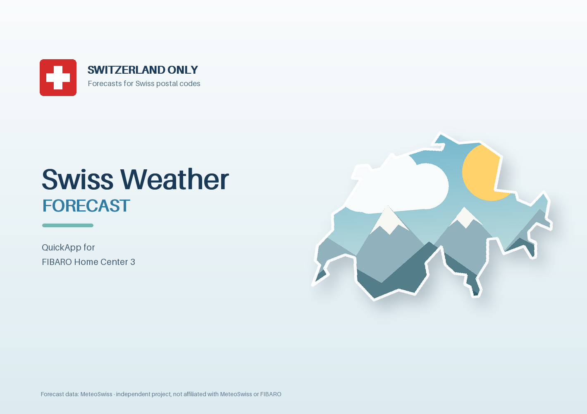

# Swiss Weather Forecast



A QuickApp for the Fibaro Home Center 3 with weather forecasts for a Swiss
postal code. Forecast data: [MeteoSwiss](https://www.meteoswiss.admin.ch).
It publishes forecast tables at 10-minute, hourly, three-hour and daily
resolution for scenes, sets the HC3 weather properties, and offers four child
devices that switch on for rain, strong wind and nice weather.

## Contents

- [How-to](#how-to)
  - [Step 1: Install](#step-1-install)
  - [Step 2: Fill in the variables](#step-2-fill-in-the-variables)
  - [Step 3: Options (optional)](#step-3-options-optional)
  - [Step 4: Check](#step-4-check)
- [Features](#features) · [Requirements](#requirements)
- [Reading forecast tables from a scene](#reading-forecast-tables-from-a-scene) ·
  [Available table values](#available-table-values)
- [Child devices](#child-devices) · [Data source and limitations](#data-source-and-limitations)
- [Troubleshooting](#troubleshooting) · [Support](#support)

## How-to

### Step 1: Install

1. Download the latest `.fqa` from the [releases](https://github.com/schopf16/fibaro-qa-meteoswiss/releases).
2. In the HC3 web interface: **Settings → Devices → Add device → Other device →
   Upload file**, and select the `.fqa`.

### Step 2: Fill in the variables

Open the new QuickApp and go to **Variables**. Saving the variables restarts
the QuickApp - this is how the HC3 applies them.

| Variable | What to enter | Default |
|---|---|---|
| `postalCode` | Four-digit Swiss postal code of the place, e.g. `8001`. General codes such as 3000 or 8000 are not known to the service: use the code of the place itself (3011, 8001) | *(empty, required)* |
| `rainThresholdMm` | The rain child switches on when a 10-minute slot (current or next) forecasts **more** than this amount | `1.0` mm |
| `strongWindThresholdKmh` | The wind child switches on when the gust forecast for the current or next hour **reaches** this speed | `45` km/h |
| `warmDayThresholdC` | Minimum daily maximum temperature for a nice day | `18` °C |

The variables `forecast10m`, `forecastHourly`, `forecast3h` and
`forecastDaily` are written by the QuickApp; leave them as they are (see
[Reading forecast tables](#reading-forecast-tables-from-a-scene)).

Until `postalCode` is valid the QuickApp shows "not configured" and does
nothing else.

### Step 3: Options (optional)

Options that rarely change are at the top of the file `App` in the
QuickApp's editor:

```lua
App.OPTIONS = {
  pollIntervalSec = 300,    -- seconds between two forecast requests: 300 to 3600
  logLevel        = "info", -- "error", "warn", "info" or "debug" (for bug reports)
  language        = "auto", -- "auto" (controller language), "en", "de", "fr" or "it"
}
```

Change a value and save; the QuickApp restarts. An invalid value is reported
in the log and replaced by its default. Note your changes: installing a newer
version of the QuickApp replaces this file.

### Step 4: Check

A few seconds after the start the status line shows "Forecast updated at
HH:MM", the QuickApp shows the postal code, and the four child devices exist.
If not, see [Troubleshooting](#troubleshooting).

## Features

- Forecast tables at 10-minute, hourly, three-hour and daily resolution,
  as JSON in QuickApp variables, all with the same structure
- Four child devices (binary sensors) for scene triggers: rain expected,
  strong wind expected, nice weather today, nice weather tomorrow
- HC3 weather properties: temperature and gust of the next hour, and a
  derived weather condition
- Sunshine duration in minutes and percent; no solar radiation or PV
  estimate is claimed
- No global variables are created
- User interface in English, German, French and Italian

## Requirements

| | |
|---|---|
| Tested with | FIBARO Home Center 3, firmware 5.220.11 |
| Not tested | All other controllers |
| Not possible | Home Center 2 and Home Center Lite: they do not run Home Center 3 QuickApps |
| Location | A Swiss postal code |
| Network access | HTTPS to the MeteoSwiss app service (internet) |

## Reading forecast tables from a scene

The tables are JSON texts in the QuickApp variables `forecast10m`,
`forecastHourly`, `forecast3h` and `forecastDaily`. Scenes read them with
`fibaro.getValue`; replace `123` with the device ID of the QuickApp (shown in
its **General** tab):

```lua
local WEATHER = 123   -- device ID of the Swiss Weather Forecast QuickApp

local function forecastTable(variableName)
  for _, variable in ipairs(fibaro.getValue(WEATHER, "quickAppVariables") or {}) do
    if variable.name == variableName then
      local ok, result = pcall(json.decode, variable.value)
      if ok and type(result) == "table" and result.schemaVersion == 1 then return result end
    end
  end
end

local hourly = forecastTable("forecastHourly")
if hourly then
  for _, row in ipairs(hourly.rows) do
    if (row.values.windGustKmh or 0) >= 60 then
      fibaro.debug("scene", "Strong gust forecast at " .. row.time)
      break
    end
  end
end
```

Every table has the same envelope:

```json
{
  "schemaVersion": 1,
  "resolution": "PT1H",
  "timeZone": "Europe/Zurich",
  "generatedAtUtc": "2026-10-05T12:00:00Z",
  "units": { "windGustKmh": "km/h" },
  "rows": [
    {
      "time": "2026-10-05T13:00:00Z",
      "epochSeconds": 1791205200,
      "current": false,
      "values": { "windGustKmh": 42.0 }
    }
  ]
}
```

- Sub-daily `time` values are UTC timestamps (ISO 8601); daily `time` values
  are local dates (`YYYY-MM-DD`). Every row has `epochSeconds`.
- `current` marks the interval that contains the present moment; past
  intervals are not included.
- A value the forecast does not provide is missing from `values`, never
  replaced by zero.
- All four tables of one update share the same `generatedAtUtc`.
- A table is at most 60000 bytes. If a forecast is longer, the most distant
  rows are left out and the log says so once.

### Available table values

| Variable | Resolution | Values |
|---|---|---|
| `forecast10m` | 10 minutes | Precipitation amount and minimum/maximum (mm) |
| `forecastHourly` | 1 hour | Temperature mean/min/max (°C), precipitation and minimum/maximum (mm), wind and gust speed with 10 % / 90 % quantiles (km/h), sunshine duration (minutes and percent of the hour) |
| `forecast3h` | 3 hours | Precipitation probability (%), wind speed (km/h), wind direction (degrees), MeteoSwiss weather code |
| `forecastDaily` | 1 day | Minimum/maximum temperature, precipitation and minimum/maximum, sunshine duration and percent of daylight, derived condition (`sunny`, `mostly_sunny`, `mixed`, `rainy`), `niceWeather` |

The horizon depends on the service. During development it returned about
26 hours of 10-minute slots, up to six days of hourly and three-hour values,
and six daily summaries. The 10-minute table shrinks during the day because
past slots are left out.

## Child devices

The QuickApp creates four binary sensors once, in this order. Their device IDs
stay the same across restarts; names, rooms and icons you change are kept. A
child deleted by hand is created again at the next start. A value is written
only when the signal changes.

| Signal | On when |
|---|---|
| Rain expected | The current or next 10-minute slot forecasts more than `rainThresholdMm` |
| Strong wind expected | The gust forecast for the current or next hour reaches `strongWindThresholdKmh` |
| Nice weather today | Today is forecast sunny or mostly sunny and the maximum temperature reaches `warmDayThresholdC` |
| Nice weather tomorrow | The same rule for tomorrow |

The service offers rain in 10-minute steps but gusts only per hour, so the two
signals look ahead differently. The nice-weather rule is a simple scene signal,
not an official MeteoSwiss category.

## Data source and limitations

Forecast data: MeteoSwiss. The QuickApp reads the service that the MeteoSwiss
app uses (`app-prod-ws.meteoswiss-app.ch`, one request every five minutes with
the postal code). This service is not a documented public interface and may
change or stop without notice. The same forecasts are published as
[MeteoSwiss open data](https://www.meteoswiss.admin.ch/services-and-publications/service/open-data.html)
(CC BY), but only as files for all of Switzerland, which are too large for a
controller.

- Forecasts only: no measured values or rain history.
- Sunshine is a duration (minutes per hour, percent of daylight per day), not
  radiation in W/m², and not a PV production forecast.
- Daily values are grouped by the controller's local date; the controller's
  time zone should be Europe/Zurich.

## Languages

The user interface is available in English, German, French and Italian and
follows the controller's language. French and Italian are not reviewed by a
native speaker - [corrections are welcome](https://github.com/schopf16/fibaro-qa-meteoswiss/issues/new?template=translation.yml).

## Privacy

The QuickApp contacts only the MeteoSwiss app service and sends only the
postal code. No credentials, no telemetry, no update checks. The log does not
contain the postal code.

## Troubleshooting

All log lines of this QuickApp carry the tag **`SWISSWEATHER`** - filter the
HC3 console by it. If the QuickApp is installed more than once, each instance
appends its device ID, e.g. `SWISSWEATHER_123`.

1. Set `logLevel = "debug"` in the [options](#step-3-options-optional) and save
   (this restarts the QuickApp).
2. Reproduce the problem.
3. Copy the log from the line `Swiss Weather Forecast v... starting ...` to the problem.
4. Also look for `QUICKAPP<id>` lines with "QuickApp crashed" - they should
   never appear; if they do, please include them.
5. Open an [issue](https://github.com/schopf16/fibaro-qa-meteoswiss/issues/new?template=bug_report.yml)
   with the log.

"Postal code unknown - please check" means the service does not know the
postal code: general codes such as 3000 (Bern) or 8000 (Zurich) do not work,
the code of the place itself does (3011, 8001).

"Forecast unavailable; retry scheduled" means the request failed (no internet,
service changed or unavailable). The QuickApp retries after 1 minute, then
with growing intervals up to 30 minutes, and keeps the last forecast tables.

## Support

- Questions and bugs: [GitHub issues](https://github.com/schopf16/fibaro-qa-meteoswiss/issues)
- Security issues: please report privately via
  [security advisories](https://github.com/schopf16/fibaro-qa-meteoswiss/security/advisories/new)

## License

[MIT](LICENSE)

Forecast data: MeteoSwiss. This is an independent project, not affiliated with
or endorsed by MeteoSwiss (Federal Office of Meteorology and Climatology) or
FIBARO. The outline of Switzerland in the image is based on Natural Earth
(public domain).
